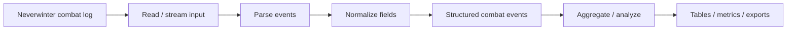
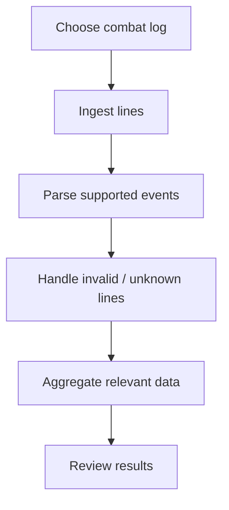

<div align="center">

# Neverwinter Combat Log

**A Neverwinter combat-log project for turning raw combat events into structured, reviewable information for analysis and tooling.**


[Browse source](https://github.com/Nischhalsubba/Neverwinter-combatlog/tree/main) · [Issues](https://github.com/Nischhalsubba/Neverwinter-combatlog/issues)

</div>

## Overview

**Neverwinter Combat Log** is documented around a data pipeline: read combat-log input, parse events, normalize useful fields, aggregate or inspect results, and present information that players or developers can reason about.

| Audience | Focus |
|---|---|
| Players / analysts | Understand combat events and resulting summaries |
| Developers | Parsing, event models, normalization and calculations |
| Designers | Dense combat data, filtering, hierarchy and comparison |
| Maintainers | Sample logs, edge cases, format changes and version assumptions |

<details open>
<summary><strong>🏗️ Interactive parsing architecture</strong></summary>



</details>

## Analysis flow



## Getting started

```bash
git clone https://github.com/Nischhalsubba/Neverwinter-combatlog.git
cd Neverwinter-combatlog
```

Use the manifests and project files to determine the current runtime and commands. Keep sample logs free of private or unrelated information before committing them.

## Data & UX principles

Parsers should fail visibly and recover gracefully. Preserve raw context when useful, distinguish parsed facts from derived calculations, document assumptions, and keep filters/metrics understandable to people who did not write the parser.

## SEO & discoverability

Use accurate terms such as **Neverwinter combat log, combat log parser, Neverwinter combat analysis, damage analysis, combat events, and Neverwinter tools** only where supported by implemented behavior.

## Contribution flow


