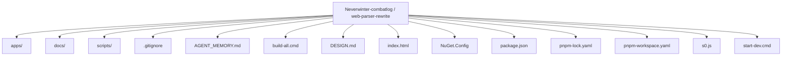
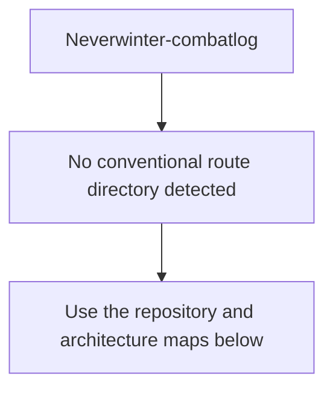
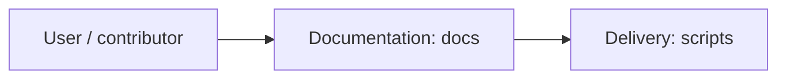
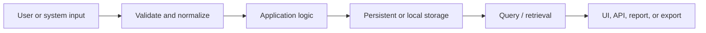
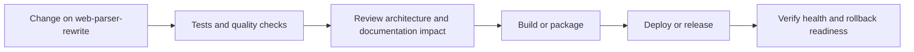
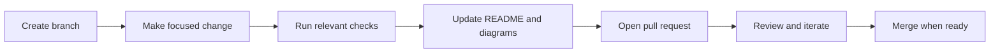

<!-- interactive-readme-standard:start -->

<div align="center">

# Neverwinter-combatlog

**Branch-aware technical guide for [`web-parser-rewrite`](https://github.com/Nischhalsubba/Neverwinter-combatlog/tree/web-parser-rewrite)**

<p>       </p>

<p>
  <a href="https://github.com/Nischhalsubba/Neverwinter-combatlog/tree/web-parser-rewrite"><strong>Browse source</strong></a> ·
  <a href="https://github.com/Nischhalsubba/Neverwinter-combatlog/issues"><strong>Issues</strong></a> ·
  <a href="https://github.com/Nischhalsubba/Neverwinter-combatlog/codespaces/new?ref=web-parser-rewrite"><strong>Open in Codespaces</strong></a>
</p>

</div>

> [!IMPORTANT]
> This guide is generated from the files actually present on `web-parser-rewrite`. It links to detected source paths, preserves project-authored notes, and avoids claiming components that were not found.

## At a glance

| Item | Detected value |
|---|---|
| Purpose | A TypeScript project documented from the current branch structure and manifests. |
| Branch role | Compared with `main` |
| Stack | TypeScript, Rust, C#, HTML, JavaScript, CSS |
| Manifests | package.json |
| Prerequisites | Node.js, pnpm |
| Delivery | No conventional deployment configuration detected |
| License | No license file detected |

## Branch scope

This branch differs from the default branch in the following detected paths:

- [`README.md`](https://github.com/Nischhalsubba/Neverwinter-combatlog/blob/web-parser-rewrite/README.md)
- [`s0.js`](https://github.com/Nischhalsubba/Neverwinter-combatlog/blob/web-parser-rewrite/s0.js)

## Quick start

```bash
pnpm install
pnpm dev
pnpm start
pnpm build
pnpm test
```

### Configuration surface

- No committed environment example file was detected.

> Never commit secrets, private keys, production credentials, customer data, or unredacted infrastructure details.

## Repository map



| Responsibility | Detected source paths |
|---|---|
| Documentation | [`docs`](https://github.com/Nischhalsubba/Neverwinter-combatlog/tree/web-parser-rewrite/docs) |
| Delivery | [`scripts`](https://github.com/Nischhalsubba/Neverwinter-combatlog/tree/web-parser-rewrite/scripts) |

## Website or application map



## Architecture and responsibility flow



<details>
<summary><strong>Data flow and model surface</strong></summary>



Detected data areas: [`apps/desktop/src-tauri/migrations/0001_initial_schema.sql`](https://github.com/Nischhalsubba/Neverwinter-combatlog/blob/web-parser-rewrite/apps/desktop/src-tauri/migrations/0001_initial_schema.sql), [`apps/windows/NexusCombatAnalyzer.Engine/Models/ParsedEvent.cs`](https://github.com/Nischhalsubba/Neverwinter-combatlog/blob/web-parser-rewrite/apps/windows/NexusCombatAnalyzer.Engine/Models/ParsedEvent.cs), [`apps/windows/NexusCombatAnalyzer.Engine/Models/EventClassification.cs`](https://github.com/Nischhalsubba/Neverwinter-combatlog/blob/web-parser-rewrite/apps/windows/NexusCombatAnalyzer.Engine/Models/EventClassification.cs), [`apps/windows/NexusCombatAnalyzer.Engine/Models/ParseOutcome.cs`](https://github.com/Nischhalsubba/Neverwinter-combatlog/blob/web-parser-rewrite/apps/windows/NexusCombatAnalyzer.Engine/Models/ParseOutcome.cs), [`apps/windows/NexusCombatAnalyzer.Engine/Models/RawLogLine.cs`](https://github.com/Nischhalsubba/Neverwinter-combatlog/blob/web-parser-rewrite/apps/windows/NexusCombatAnalyzer.Engine/Models/RawLogLine.cs), [`apps/windows/NexusCombatAnalyzer.Engine/Models/ParseFailure.cs`](https://github.com/Nischhalsubba/Neverwinter-combatlog/blob/web-parser-rewrite/apps/windows/NexusCombatAnalyzer.Engine/Models/ParseFailure.cs).

</details>

## Quality, security, and operations

<table>
<tr>
<td width="33%" valign="top">

### Quality

- No conventional test directory was detected automatically.

Detected commands:
- `pnpm dev`
- `pnpm start`
- `pnpm build`
- `pnpm test`

</td>
<td width="33%" valign="top">

### Security

- No dedicated security policy or automated dependency configuration was detected.

Review authentication, authorization, input validation, dependency updates, secret handling, and failure recovery before release.

</td>
<td width="34%" valign="top">

### Observability

- No dedicated observability integration was detected automatically.

Define useful logs, metrics, traces, alerts, and rollback signals for production-facing branches.

</td>
</tr>
</table>

## Delivery flow



### Automation detected

- No GitHub Actions workflow files were detected.

## Contribution flow



- Keep changes focused and explain architectural consequences.
- Run the checks relevant to the changed area.
- Update diagrams whenever routes, modules, data models, authentication, jobs, or delivery paths change.
- Add screenshots or recordings for visual behavior changes when useful.
- Use issues for reproducible defects and pull requests for reviewable changes.

## Ownership and support

| Topic | Source |
|---|---|
| Repository | [`Nischhalsubba/Neverwinter-combatlog`](https://github.com/Nischhalsubba/Neverwinter-combatlog) |
| Branch | [`web-parser-rewrite`](https://github.com/Nischhalsubba/Neverwinter-combatlog/tree/web-parser-rewrite) |
| Ownership | No CODEOWNERS file detected |
| Contributing | Use the contribution flow above |
| Support | [Open or review issues](https://github.com/Nischhalsubba/Neverwinter-combatlog/issues) |
| License | No license file detected |

<details>
<summary><strong>Documentation maintenance checklist</strong></summary>

- [ ] Purpose and branch scope are accurate.
- [ ] Setup and configuration commands still work.
- [ ] Repository, application, API, data, authentication, job, and deployment diagrams match the code.
- [ ] Tests, security controls, observability, and rollback behavior are documented.
- [ ] Links point to real files on this branch.
- [ ] No secrets or private operational details are exposed.

</details>

<!-- interactive-readme-standard:end -->

<!-- project-authored-notes:start -->
<details>
<summary><strong>Project-authored notes preserved from this branch</strong></summary>

# Astral Combat

Windows-first desktop combat log analyzer for Neverwinter. Astral Combat focuses on simple visual reads: live damage, replay review, companion attribution, player breakdowns, charts, and a compact widget.

The finalized PRD, UI/UX specification, technical specification, and delivery backlog are the source of truth for this repository.

ACT/Neverwinter plugin parity is tracked in `docs\ACT_PARITY.md`. The current engine already ports the Neverwinter field mapping, owner/companion attribution, damage aggregation, and ACT-style `EncDPS`; remaining ACT columns and export variables are listed there as implementation work.

## Optional AI Insights

Astral Combat can generate short AI combat reviews from parsed summary metrics. This is optional and disabled until you add your own API key.

Current provider:

- OpenRouter `openrouter/free`
- Uses OpenRouter free-model routing when available
- Sends summary metrics only, not the full raw combat log
- Stores the API key in the current browser profile through `localStorage`

Setup:

1. Create an OpenRouter API key.
2. Run `.\start-dev.cmd`.
3. Open `Settings`.
4. Paste the key under `OpenRouter free-model insights`.
5. Keep the model as `openrouter/free` unless you want a specific OpenRouter model.
6. Open `Live` or a player detail page and click `Generate` in the AI Analyst panel.

## Stack

- Desktop shell: .NET 8 WPF + Microsoft WebView2
- Runtime/parser: C#/.NET
- UI: React + TypeScript + Vite
- Storage: SQLite
- Client state: Zustand + TanStack Query

Previous Rust/Tauri work remains in `apps/desktop/src-tauri` for reference, but it is superseded for the Windows runtime because Windows Application Control blocked Rust-generated build executables on the target machine.

## Prerequisites

Install these once on the Windows machine:

1. Node.js LTS from `https://nodejs.org`
2. .NET 8 SDK from `https://dotnet.microsoft.com/download/dotnet/8.0`
3. Microsoft WebView2 Runtime if Windows does not already have it
4. Git, if you plan to clone or version the repository

After installing Node.js or .NET, close and reopen PowerShell so `node`, `corepack`, and `dotnet` are available on `PATH`.

Quick prerequisite check:

```powershell
node --version
corepack --version
dotnet --version
```

## Run Locally

Open PowerShell in the repository root:

```powershell
cd C:\Users\acer\OneDrive\Documents\Projects\Neverwinter-combatlog
```

One command installs dependencies and starts the app in browser-safe mode:

```powershell
.\start-dev.cmd
```

Equivalent package command:

```powershell
corepack pnpm start
```

What this does:

- Uses pnpm through Corepack without writing shims into `C:\Program Files\nodejs`.
- Installs workspace dependencies with pnpm.
- Starts the React/Vite dev server on `http://127.0.0.1:1420`.
- Opens the app in your default browser.
- Uses the in-browser parser fallback when Windows Application Control blocks generated desktop assemblies.

Browser-safe mode supports selecting/importing combat log files, parsing logs, replay review, charts, player detail pages, reset history, and the in-app widget. True live folder tailing requires a native desktop host, but your current Windows policy blocks generated `.dll` files too.

If your machine later allows the .NET host, start the desktop WebView2 shell explicitly:

```powershell
.\start-dev.cmd -Desktop
```

## Build Locally

One command installs dependencies, runs checks, builds web assets, and builds the Windows desktop app:

```powershell
.\build-all.cmd
```

Equivalent package command:

```powershell
corepack pnpm build:all
```

Expected output:

- TypeScript check runs first.
- C# parser/engine tests run next.
- Vite web build runs next.
- .NET Windows desktop publish runs last.

Published Windows files are generated under:

```text
dist\windows
```

## Manual Development Commands

Install dependencies:

```powershell
corepack pnpm install
```

Start the browser-safe dev app:

```powershell
.\start-dev.cmd
```

Start the desktop host only when Windows Application Control allows generated .NET assemblies:

```powershell
.\start-dev.cmd -Desktop
```

Build only the frontend web assets:

```powershell
corepack pnpm --filter @nevercombat/desktop web:build
```

Run only the C# parser/engine tests:

```powershell
dotnet run --project apps\windows\NexusCombatAnalyzer.Tests\NexusCombatAnalyzer.Tests.csproj
```

Publish only the .NET desktop host:

```powershell
dotnet restore apps\windows\NexusCombatAnalyzer.Host\NexusCombatAnalyzer.Host.csproj --configfile NuGet.Config -r win-x64
dotnet publish apps\windows\NexusCombatAnalyzer.Host\NexusCombatAnalyzer.Host.csproj -c Release -r win-x64 --self-contained false -o dist\windows --no-restore
```

## Automated Tests And Checks

Run TypeScript checks:

```powershell
corepack pnpm --filter @nevercombat/desktop test
```

Run C# parser/engine tests:

```powershell
dotnet run --project apps\windows\NexusCombatAnalyzer.Tests\NexusCombatAnalyzer.Tests.csproj
```

Full local check sequence:

```powershell
corepack pnpm --filter @nevercombat/desktop test
dotnet run --project apps\windows\NexusCombatAnalyzer.Tests\NexusCombatAnalyzer.Tests.csproj
corepack pnpm --filter @nevercombat/desktop web:build
dotnet restore apps\windows\NexusCombatAnalyzer.Host\NexusCombatAnalyzer.Host.csproj --configfile NuGet.Config -r win-x64
dotnet publish apps\windows\NexusCombatAnalyzer.Host\NexusCombatAnalyzer.Host.csproj -c Release -r win-x64 --self-contained false -o dist\windows --no-restore
```

## Product Test Checklist

Use this after `.\start-dev.cmd` opens the desktop app.

### Live

1. Open `Live`.
2. Click `Log Folder`.
3. Select the folder that contains Neverwinter `Combat*.log` files.
4. Confirm the top app bar changes from no source to the selected combat log.
5. Confirm damage cards, charts, parser review, and recent reads update.
6. Click `Log File` and select a specific `.log` file.
7. Confirm the same live dashboard updates from that file.
8. Click `New Fight`.
9. Confirm current damage resets and the previous counter appears under the saved fight tab.

### Player And Companion Damage

1. Confirm `Player table` shows player rows.
2. Toggle `Add companions to owner totals`.
3. Confirm player totals include companion damage when enabled and exclude companion damage when disabled.
4. Confirm `Companion damage` still shows companion/entity damage separately.
5. Click a player name in the damage chart or player table.
6. Confirm the player detail page opens at `/live/players/:playerName`.
7. Confirm the detail page shows rank, damage, share, hits, crit rate, top power, damage trend, and top powers.

### Replay

1. Open `Replay`.
2. Click `Import Log`.
3. Select one or more recorded `.log` files.
4. Confirm imported logs appear in the list.
5. Confirm replay damage, companion damage, parsed lines, failed lines, and ranking details update.

### Widget

1. Open `Live`.
2. Click `Show Widget`.
3. Confirm the in-app floating widget appears.
4. Click `Hide Widget`.
5. Confirm it closes.
6. Reopen it, then click `Choose Log Folder`, `Choose Log File`, or `Import Logs`.
7. Confirm file dialogs still open while the widget is open.

### Parser Health

1. Use a valid combat log and confirm most lines parse.
2. Use a malformed or unrelated text file renamed as `.log`.
3. Confirm failed lines are counted under parser review instead of being silently ignored.

## Why The Runtime Moved From Rust To C#

The first scaffold used Tauri/Rust, but the target Windows machine blocks Rust-generated build executables with:

```text
An Application Control policy has blocked this file. (os error 4551)
```

That happened during `tauri dev`, `cargo test`, and Tauri release builds, even after moving Cargo output outside the OneDrive folder. This is an operating-system policy blocker, not a parser source bug.

The active path is now:

- C#/.NET parser and combat engine
- WPF/WebView2 Windows host
- Existing React/MUI visual UI

This aligns better with legacy ACT/Neverwinter plugin code, which is also C#.

## Current Migration Status

- C# engine scaffold exists under `apps\windows\NexusCombatAnalyzer.Engine`.
- C# parser tests exist under `apps\windows\NexusCombatAnalyzer.Tests`.
- .NET desktop host scaffold exists under `apps\windows\NexusCombatAnalyzer.Host`.
- React/MUI UI still exists under `apps\desktop`.
- The old Rust/Tauri code is retained only as a reference until the .NET host reaches parity.

## Troubleshooting

Clear generated dependencies and rebuild:

```powershell
Remove-Item -Recurse -Force "node_modules" -ErrorAction SilentlyContinue
Remove-Item -Recurse -Force "apps\desktop\node_modules" -ErrorAction SilentlyContinue
Remove-Item -Recurse -Force "apps\desktop\dist" -ErrorAction SilentlyContinue
Remove-Item -Recurse -Force "C:\Users\acer\AppData\Local\NeverwinterCombatAnalyzer\cargo-target" -ErrorAction SilentlyContinue
corepack pnpm install
```

If pnpm is not recognized:

```powershell
corepack pnpm --version
```

Do not run `corepack enable` unless PowerShell is opened as Administrator. On some Windows installs it tries to write `pnpx.CMD` into `C:\Program Files\nodejs` and fails with:

```text
EPERM: operation not permitted, open 'C:\Program Files\nodejs\pnpx.CMD'
```

The project scripts use `corepack pnpm ...` directly to avoid that Program Files write.

If .NET is not recognized:

```powershell
dotnet --version
```

Install the .NET 8 SDK, not only the runtime, then reopen PowerShell.

If the build fails with:

```text
NU1100: Unable to resolve 'Microsoft.Web.WebView2'
```

the machine has no usable NuGet package source configured or cannot reach NuGet. This repository includes `NuGet.Config` pointing to:

```text
https://api.nuget.org/v3/index.json
```

Retry from the repository root:

```powershell
dotnet restore apps\windows\NexusCombatAnalyzer.Host\NexusCombatAnalyzer.Host.csproj --configfile NuGet.Config
.\build-all.cmd
```

If the build fails with:

```text
NETSDK1047: Assets file ... doesn't have a target for 'net8.0-windows/win-x64'
```

restore was run without the Windows runtime identifier. Run:

```powershell
dotnet restore apps\windows\NexusCombatAnalyzer.Host\NexusCombatAnalyzer.Host.csproj --configfile NuGet.Config -r win-x64
.\build-all.cmd
```

If `.\start-dev.cmd -Desktop` fails with:

```text
An Application Control policy has blocked this file. (os error 4551)
```

the local Windows policy is blocking generated .NET assemblies. The normal `.\start-dev.cmd` command now avoids this by running the app in browser-safe mode:

```powershell
.\start-dev.cmd
```

Use `.\start-dev.cmd -Desktop` only after this project path or generated build output is approved by Windows Application Control.

If WebView2 shows:

```text
We couldn't create the data directory
Microsoft Edge can't read and write to its data directory:
C:\Program Files\dotnet\dotnet.exe.WebView2\EBWebView
```

the app is being launched through `dotnet.exe`, so WebView2 tried to place browser data beside `dotnet.exe`. The host now sets its WebView2 user data folder to:

```text
%LOCALAPPDATA%\AstralCombat\WebView2
```

Retry:

```powershell
.\start-dev.cmd
```

If restore still fails, check that Windows, antivirus, firewall, or a corporate proxy is not blocking `api.nuget.org`.

If the app opens but no combat data appears:

- Make sure Neverwinter has written a `Combat*.log` file.
- Use `Log Folder` for the folder containing the latest `Combat*.log`.
- Use `Log File` to force a specific log file.
- Import the same file under `Replay` to check whether the parser can read it as a recorded log.

## Design Direction

Astral Combat uses a new identity built for fast endgame reads:

- Dark left navigation for app orientation.
- Bright readable work area for charts and tables.
- Emerald, cyan, crimson, and amber accents for combat meaning.
- Short labels such as `Live`, `Replay`, `New Fight`, and `Log File`.
- Charts before tables wherever possible.
- Companion damage visible separately and optionally merged into owners.

## Product Principles

- Parse every combat log line.
- Store raw and normalized data.
- Never drop malformed lines silently.
- Preserve ACT parity before improving on top.
- Keep live mode fast, replay mode detailed, and debug mode transparent.

</details>
<!-- project-authored-notes:end -->
