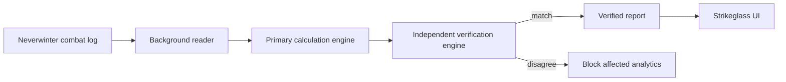

<div align="center">

# Strikeglass

**See the fight clearly.**

A local-first Neverwinter combat log analyzer for damage, DPS, boss fights, player comparison, power analysis, and raw-hit review.


[Open Strikeglass](https://neverwinter-combatlog.hinischalsubba.workers.dev/) · [How to use](https://neverwinter-combatlog.hinischalsubba.workers.dev/how-to-use/) · [Source](https://github.com/Nischhalsubba/Neverwinter-combatlog/tree/main) · [Issues](https://github.com/Nischhalsubba/Neverwinter-combatlog/issues)

</div>

## What Strikeglass does

Strikeglass reads Neverwinter combat logs in the browser, calculates combat results, and checks important published values with a separate verification engine before showing them. The combat log itself stays on the device during analysis.

| Area | What it answers |
|---|---|
| Summary | How much damage did the group and each player do? |
| DPS / Active DPS | How quickly was that damage dealt using elapsed and active-combat clocks? |
| Boss Fights | What happened in one detected boss fight? |
| Compare Players | How do selected players compare inside the same fight? |
| Powers | Which powers produced the damage and what did individual hits look like? |
| Power Timing | When did important powers activate? |
| Log Health | What could not be parsed or safely verified? |

## Architecture



Large logs are streamed into worker-owned compact storage. Raw events are paged rather than copied into the full frontend state, charts are downsampled for display only, and authoritative totals come from verified aggregates.

## Getting started locally

Requirements: Node.js 22+ and pnpm 9+.

```bash
git clone https://github.com/Nischhalsubba/Neverwinter-combatlog.git
cd Neverwinter-combatlog
corepack enable
corepack prepare pnpm@9.15.0 --activate
pnpm install --frozen-lockfile
pnpm --dir app check
pnpm --dir app start
```

## Public product pages

The production build publishes a small set of indexable pages around the analyzer:

- `/` — Strikeglass analyzer and product overview
- `/how-to-use/` — enabling combat logging and using the app
- `/dps-explained/` — damage, DPS, Active DPS, group share, critical rate, and Combat Advantage
- `/privacy/` — local processing and external-library disclosure
- `/about/` — product purpose and verification approach

Search discovery files are published at `/robots.txt`, `/sitemap.txt`, and `/site.webmanifest`.

## Data and UX principles

- Accuracy comes before presentation.
- Parser or verifier disagreements must be visible rather than averaged away.
- Player-facing labels use normal combat language; internal parser terminology belongs in Log Health.
- Presentation may abbreviate values with K, M, and B, but formatting must never change the underlying calculation.
- Heavy analysis stays off the main thread where practical.
- Hidden or offscreen UI must not trigger unnecessary full-log work.

## Ground-truth fixtures

Synthetic regressions protect known edge cases, but the strongest numerical tests come from real anonymized Neverwinter logs paired with trusted reference values. See `ENGINE_GROUND_TRUTH.md` for the fixture requirements and acceptance process.

## Brand and SEO

- `BRAND.md` is the canonical product identity and voice guide.
- `MASTER.md` is the canonical UI/design and performance system.
- `app/site.config.mjs` is the source of truth for the current production origin used by SEO generation work.

Strikeglass is an independent community tool and is not affiliated with or endorsed by Arc Games or Cryptic Studios. Neverwinter and related names belong to their respective owners.
