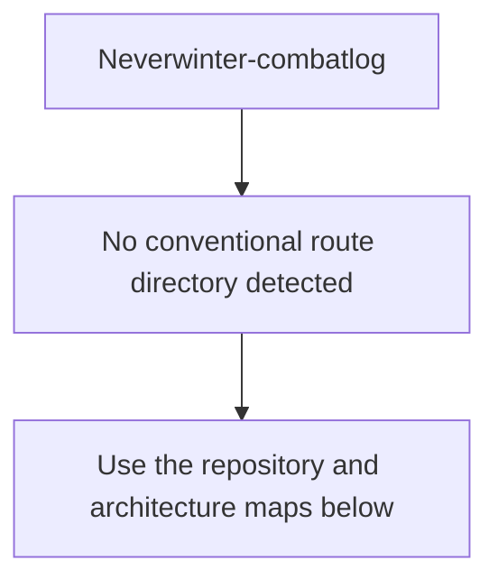
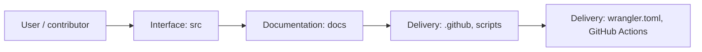
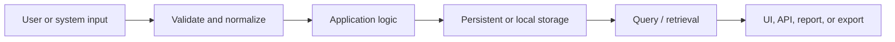
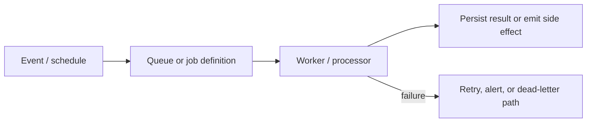
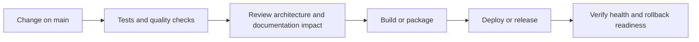
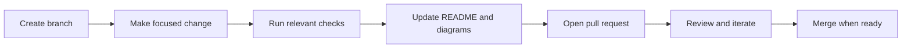

<!-- interactive-readme-standard:start -->

<div align="center">

# Neverwinter-combatlog

**Branch-aware technical guide for [`main`](https://github.com/Nischhalsubba/Neverwinter-combatlog/tree/main)**

<p>       </p>

<p>
  <a href="https://github.com/Nischhalsubba/Neverwinter-combatlog/tree/main"><strong>Browse source</strong></a> ·
  <a href="https://github.com/Nischhalsubba/Neverwinter-combatlog/issues"><strong>Issues</strong></a> ·
  <a href="https://github.com/Nischhalsubba/Neverwinter-combatlog/codespaces/new?ref=main"><strong>Open in Codespaces</strong></a>
</p>

</div>

> [!IMPORTANT]
> This guide is generated from the files actually present on `main`. It links to detected source paths, preserves project-authored notes, and avoids claiming components that were not found.

## At a glance

| Item | Detected value |
|---|---|
| Purpose | A local-first browser-based Neverwinter combat-log analyzer with parser smoke tests, encounter filtering, party overview, player comparison, companion damage, artifact-window analysis, class detection, raw-hit validation, Cloudflare Worker static deployment, and optional Supabase scaffolding. |
| Branch role | Default branch |
| Stack | TypeScript, JavaScript, Rust, C#, CSS, HTML |
| Manifests | package.json |
| Prerequisites | Node.js, pnpm |
| Delivery | wrangler.toml, GitHub Actions |
| License | No license file detected |

## Branch scope

This is the repository's default branch.


## Quick start

```bash
pnpm install
pnpm dev
pnpm start
pnpm build
pnpm test
```

### Configuration surface

- `.env.example`

> Never commit secrets, private keys, production credentials, customer data, or unredacted infrastructure details.

## Repository map



```mermaid
flowchart TD
    ROOT["Neverwinter-combatlog / main"]
    ROOT --> P0[".github/"]
    ROOT --> P1["apps/"]
    ROOT --> P2["docs/"]
    ROOT --> P3["scripts/"]
    ROOT --> P4["src/"]
    ROOT --> P5[".env.example"]
    ROOT --> P6[".gitignore"]
    ROOT --> P7[".nojekyll"]
    ROOT --> P8["AGENT_MEMORY.md"]
    ROOT --> P9["app.js"]
    ROOT --> P10["asset-codex-layer.js"]
    ROOT --> P11["asset-coverage-layer.js"]
    ROOT --> P12["assets.js"]
    ROOT --> P13["build-all.cmd"]
    ROOT --> P14["build-static.mjs"]
    ROOT --> P15["class-detection-layer.js"]
    ROOT --> P16["class-power-map.js"]
    ROOT --> P17["DESIGN.md"]
    ROOT --> MORE["+ 17 more top-level entries"]
```

| Responsibility | Detected source paths |
|---|---|
| Interface | [`src`](https://github.com/Nischhalsubba/Neverwinter-combatlog/tree/main/src) |
| Documentation | [`docs`](https://github.com/Nischhalsubba/Neverwinter-combatlog/tree/main/docs) |
| Delivery | [`.github`](https://github.com/Nischhalsubba/Neverwinter-combatlog/tree/main/.github), [`scripts`](https://github.com/Nischhalsubba/Neverwinter-combatlog/tree/main/scripts) |

## Website or application map



## Architecture and responsibility flow



<details>
<summary><strong>Data flow and model surface</strong></summary>



Detected data areas: [`apps/desktop/src-tauri/migrations/0001_initial_schema.sql`](https://github.com/Nischhalsubba/Neverwinter-combatlog/blob/main/apps/desktop/src-tauri/migrations/0001_initial_schema.sql), [`apps/windows/NexusCombatAnalyzer.Engine/Models/ParsedEvent.cs`](https://github.com/Nischhalsubba/Neverwinter-combatlog/blob/main/apps/windows/NexusCombatAnalyzer.Engine/Models/ParsedEvent.cs), [`apps/windows/NexusCombatAnalyzer.Engine/Models/EventClassification.cs`](https://github.com/Nischhalsubba/Neverwinter-combatlog/blob/main/apps/windows/NexusCombatAnalyzer.Engine/Models/EventClassification.cs), [`apps/windows/NexusCombatAnalyzer.Engine/Models/ParseOutcome.cs`](https://github.com/Nischhalsubba/Neverwinter-combatlog/blob/main/apps/windows/NexusCombatAnalyzer.Engine/Models/ParseOutcome.cs), [`apps/windows/NexusCombatAnalyzer.Engine/Models/RawLogLine.cs`](https://github.com/Nischhalsubba/Neverwinter-combatlog/blob/main/apps/windows/NexusCombatAnalyzer.Engine/Models/RawLogLine.cs), [`apps/windows/NexusCombatAnalyzer.Engine/Models/ParseFailure.cs`](https://github.com/Nischhalsubba/Neverwinter-combatlog/blob/main/apps/windows/NexusCombatAnalyzer.Engine/Models/ParseFailure.cs), [`src/integrations/supabase/browser-client.js`](https://github.com/Nischhalsubba/Neverwinter-combatlog/blob/main/src/integrations/supabase/browser-client.js), [`src/integrations/supabase/README.md`](https://github.com/Nischhalsubba/Neverwinter-combatlog/blob/main/src/integrations/supabase/README.md).

</details>
<details>
<summary><strong>Background jobs and scheduled work</strong></summary>



Relevant detected files: [`worker.js`](https://github.com/Nischhalsubba/Neverwinter-combatlog/blob/main/worker.js), [`src/workers/parse-worker.js`](https://github.com/Nischhalsubba/Neverwinter-combatlog/blob/main/src/workers/parse-worker.js), [`src/features/worker-parse-controller.js`](https://github.com/Nischhalsubba/Neverwinter-combatlog/blob/main/src/features/worker-parse-controller.js).

</details>

## Quality, security, and operations

<table>
<tr>
<td width="33%" valign="top">

### Quality

- No conventional test directory was detected automatically.

Detected commands:
- `pnpm dev`
- `pnpm start`
- `pnpm build`
- `pnpm test`

</td>
<td width="33%" valign="top">

### Security

- No dedicated security policy or automated dependency configuration was detected.

Review authentication, authorization, input validation, dependency updates, secret handling, and failure recovery before release.

</td>
<td width="34%" valign="top">

### Observability

- No dedicated observability integration was detected automatically.

Define useful logs, metrics, traces, alerts, and rollback signals for production-facing branches.

</td>
</tr>
</table>

## Delivery flow



### Automation detected

- [`.github/workflows/apply-interactive-readme.yml`](https://github.com/Nischhalsubba/Neverwinter-combatlog/blob/main/.github/workflows/apply-interactive-readme.yml)

## Contribution flow



- Keep changes focused and explain architectural consequences.
- Run the checks relevant to the changed area.
- Update diagrams whenever routes, modules, data models, authentication, jobs, or delivery paths change.
- Add screenshots or recordings for visual behavior changes when useful.
- Use issues for reproducible defects and pull requests for reviewable changes.

## Ownership and support

| Topic | Source |
|---|---|
| Repository | [`Nischhalsubba/Neverwinter-combatlog`](https://github.com/Nischhalsubba/Neverwinter-combatlog) |
| Branch | [`main`](https://github.com/Nischhalsubba/Neverwinter-combatlog/tree/main) |
| Ownership | No CODEOWNERS file detected |
| Contributing | Use the contribution flow above |
| Support | [Open or review issues](https://github.com/Nischhalsubba/Neverwinter-combatlog/issues) |
| License | No license file detected |

<details>
<summary><strong>Documentation maintenance checklist</strong></summary>

- [ ] Purpose and branch scope are accurate.
- [ ] Setup and configuration commands still work.
- [ ] Repository, application, API, data, authentication, job, and deployment diagrams match the code.
- [ ] Tests, security controls, observability, and rollback behavior are documented.
- [ ] Links point to real files on this branch.
- [ ] No secrets or private operational details are exposed.

</details>

<!-- interactive-readme-standard:end -->

<!-- project-authored-notes:start -->
<details>
<summary><strong>Project-authored notes preserved from this branch</strong></summary>

# Strikeglass

A local-first combat log analyzer for **Neverwinter** players who want clear, verifiable performance insights without uploading their logs to a server.

Strikeglass parses combat logs in the browser and turns raw events into useful answers: what dealt damage, which powers carried a run, where combat time was lost, what pressured survivability, and how party members compared within a selected encounter.

> **Project status:** Active development. Core parsing, encounter filtering, player comparison, companion analysis, class detection, and metric explanations are implemented. Results should still be verified against raw hits when testing new log formats or edge cases.

## Why Strikeglass

Most combat logs are technically rich and practically exhausting. Strikeglass is designed around five principles:

- **Local-first privacy:** combat logs stay on the user's device by default.
- **Plain-language metrics:** important labels, numbers, rows, and controls explain themselves.
- **Decision-focused analysis:** the interface emphasizes rotation, contribution, downtime, positioning, and survival pressure.
- **Traceable results:** major metrics can be checked against parsed combat-log events.
- **Independent product design:** the workflow may feel familiar to experienced parser users, but the interface and visual system are original.

## Current capabilities

### Party and encounter analysis

- Party overview with class detection and high-level contribution.
- Encounter-scoped rankings for boss, mob, or selected combat windows.
- Clickable party rows that preserve the active encounter filter.
- Player comparison across damage, DPS, combat DPS, critical rate, flank rate, and companion contribution.

### Player analysis

- Summary cards for damage, DPS, combat DPS, hits, critical rate, flank rate, healing, damage taken, and shielding.
- Power breakdowns with matched Neverwinter asset icons where available.
- Raw-hit inspection for validating individual powers and parser output.
- Timing, rotation, deaths, positioning, and formula-reference views.

### Companion and asset tools

- Toggle between player-only and companion-inclusive damage.
- Companion damage ranking for pets, summons, and companion powers.
- Asset Codex for auditing class power names against available icon filenames.
- Fallback handling for powers without matched assets.

## Metric definitions

| Metric | Definition |
|---|---|
| Total Damage | All valid physical damage attributed to the selected player in the active scope. |
| DPS | Total damage divided by the full duration from the first to the last damage event. Downtime lowers this value. |
| Combat DPS | Total damage divided by active encounter combat time. This is usually more useful for performance comparison. |
| Critical Rate | Critical hits divided by total valid hits. |
| Flank Rate | Combat-advantage hits divided by total valid hits. |
| Damage Taken | Physical damage received by the selected player. |
| Shielded | Shield-absorption events credited to the selected player in the log. |
| Companion Damage | Damage from sources classified as companions, pets, summons, or appointment-style entities. |

## Privacy model

Combat-log parsing happens locally in the browser. Strikeglass does not require logs to be uploaded to a backend.

The repository contains an optional Supabase scaffold for future online features such as saved reports, shared links, accounts, or guild dashboards. Any future feature that sends combat data off-device should make that behavior explicit before transmission.

## Requirements

- Node.js for build and smoke-test scripts.
- pnpm 9.x, as declared in `package.json`.
- Python 3 for the included local static server command.

## Run locally

```bash
pnpm install
pnpm build
pnpm start
```

Open:

```text
http://localhost:5173
```

For quick visual inspection, the static app shell can also be opened directly from `index.html`, although running the local server is more representative of the deployed environment.

## Verify a change

Run the repository smoke test:

```bash
pnpm test
```

Run a production-style static build:

```bash
pnpm build
```

When changing parser logic or formulas, also verify the result in the raw-hit inspector against representative combat-log rows. Automated smoke tests cannot prove that every Neverwinter log variation is classified correctly.

## Deployment

The Cloudflare Worker serves the generated static application from `public/`.

The build script copies the application shell, runtime compatibility files, and the `src/` directory into the deployable output.

Relevant files:

```text
worker.js
wrangler.toml
build-static.mjs
```

## Architecture

Strikeglass is a static browser application with a layered runtime:

1. Shared utilities initialize escaping, normalization, DOM helpers, tooltips, and drawers.
2. The parser reads Neverwinter combat-log events.
3. The base dashboard renders parsed results.
4. Asset and class layers enrich powers and player data.
5. Feature layers add encounter scope, comparison, companions, class detection, onboarding, and the Asset Codex.
6. The shared help controller provides hover and click explanations.
7. The design-system stylesheet controls tokens, layout, states, and motion.

See [`docs/architecture.md`](docs/architecture.md) for the current loading order and DRY rules.

## Repository map

```text
index.html                                  Application shell and script load order
styles.css                                 Base compatibility styles
src/core/sg-core.js                        Shared DOM, escaping, normalization, and style helpers
src/core/sg-help-primitives.js             Shared tooltip and drawer primitives
src/engine/combat-engine.js                Modular parser and metric engine
src/ui/sg-design-system.css                Design tokens, layout, component states, and motion
src/ui/upload-flow.css                     Upload-first and first-run styles
src/features/help-controller.js            Shared tooltip and explanation-drawer behavior
src/features/upload-flow.js                Upload journey and first-run guidance
src/features/chart-controller.js           ApexCharts integration and chart controls
src/integrations/supabase/browser-client.js Optional Supabase browser client
parser.js                                  Current compatibility parser layer
app.js                                     Base dashboard renderer
assets.js                                  Neverwinter asset URL resolver
asset-coverage-layer.js                    Missing-icon coverage and fallback candidates
class-power-map.js                         Class and power lookup data
feature-layer.js                           Encounter scope, comparison, and companion controls
guided-ux-layer.js                         Onboarding, encounter filters, and class correction
class-detection-layer.js                   Full-log class inference
asset-codex-layer.js                       Power-to-image audit screen
worker.js                                  Cloudflare Worker entry point
wrangler.toml                              Cloudflare deployment configuration
build-static.mjs                           Static build script
scripts/smoke-test.mjs                     Build and runtime smoke checks
docs/architecture.md                       Architecture and contribution rules
```

## Development rules

- Put new shared behavior under `src/`.
- Reuse helpers from `SG.escape`, `SG.normalize`, `SG.slug`, and the shared tooltip/drawer primitives.
- Add visual tokens to `src/ui/sg-design-system.css` rather than scattering one-off values through injected styles.
- Treat root-level feature files as compatibility layers.
- Avoid introducing new root-level patch files unless compatibility genuinely requires one.
- Keep reduced-motion behavior intact when adding animation.
- Make new metrics traceable to parsed source events.

## Supabase scaffold

The optional browser integration currently lives in:

```text
.env.example
src/integrations/supabase/browser-client.js
src/integrations/supabase/README.md
```

The helper exposes:

```js
const supabase = await window.StrikeglassSupabase.createClient()
```

This integration is not required for local combat-log parsing.

## Known limitations

- Combat-log formats and entity naming can contain edge cases that require new classification rules.
- Power icons depend on available filename mappings and external asset coverage.
- Class detection is inferred from full-log evidence and may need correction for unusual or incomplete logs.
- Parser results should be validated before being treated as authoritative for competitive comparisons.
- Online report storage and sharing are scaffolded concepts, not part of the default local-first workflow.

## Contributing

Small, focused changes are safest.

Before submitting a change:

1. Run `pnpm test`.
2. Run `pnpm build`.
3. Test with at least one representative combat log.
4. Compare changed metrics with raw events.
5. Confirm the app remains usable with reduced motion enabled.
6. Document any new formula, classifier, or external data dependency.

## Disclaimer

Strikeglass is an independent community project and is not affiliated with or endorsed by Cryptic Studios, Arc Games, Gearbox Publishing, or the Neverwinter rights holders. Game names, icons, and related assets belong to their respective owners.

</details>
<!-- project-authored-notes:end -->
