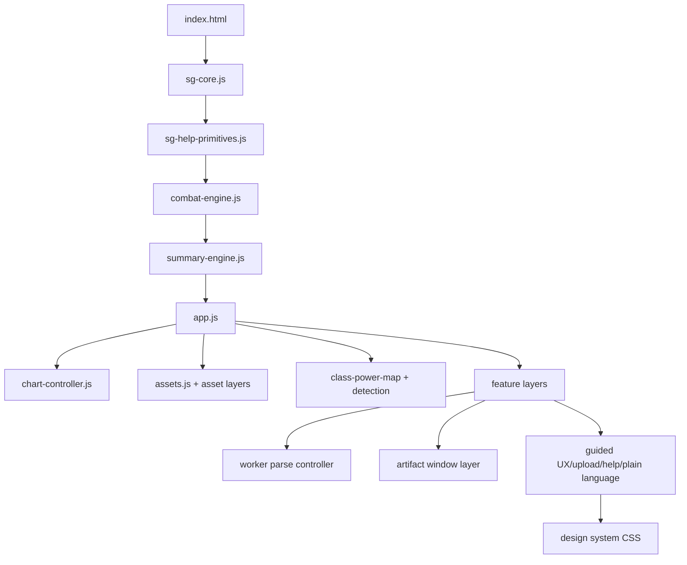
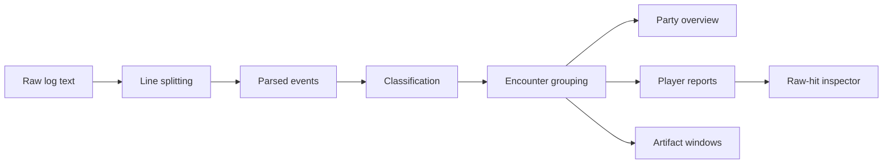

# Strikeglass — Product and Engineering Case Study

> A comprehensive product, parser, privacy, performance, QA, deployment, and maintenance case study for the Strikeglass / Neverwinter-combatlog repository. This document is intentionally detailed so future maintainers, portfolio reviewers, combat-log nerds, and AI coding agents can understand the system without turning runtime script order into a campfire legend. We document because memory is just cache with anxiety.

## Table of Contents

1. [Executive Summary](#executive-summary)
2. [Repository Snapshot](#repository-snapshot)
3. [Product Context](#product-context)
4. [Problem Statement](#problem-statement)
5. [Target Users](#target-users)
6. [Core Product Promise](#core-product-promise)
7. [Privacy Model](#privacy-model)
8. [Information Architecture](#information-architecture)
9. [Runtime Architecture](#runtime-architecture)
10. [Script Loading Contract](#script-loading-contract)
11. [Parser and Engine Model](#parser-and-engine-model)
12. [Encounter and Scope Model](#encounter-and-scope-model)
13. [Metric Definitions and Trust](#metric-definitions-and-trust)
14. [Party Overview and Lazy Details](#party-overview-and-lazy-details)
15. [Player Report Workflow](#player-report-workflow)
16. [Companion and Pet Analysis](#companion-and-pet-analysis)
17. [Artifact Window Analysis](#artifact-window-analysis)
18. [Class Detection and Correction](#class-detection-and-correction)
19. [Asset and Icon Mapping](#asset-and-icon-mapping)
20. [Raw-Hit Validation Strategy](#raw-hit-validation-strategy)
21. [Worker Parsing and Performance](#worker-parsing-and-performance)
22. [ZIP, Compare, and Export Workflows](#zip-compare-and-export-workflows)
23. [Design System Direction](#design-system-direction)
24. [Accessibility Strategy](#accessibility-strategy)
25. [Supabase Scaffold and Future Online Features](#supabase-scaffold-and-future-online-features)
26. [Cloudflare Worker Deployment](#cloudflare-worker-deployment)
27. [Smoke Test Contract](#smoke-test-contract)
28. [Testing and QA Strategy](#testing-and-qa-strategy)
29. [Risk Register](#risk-register)
30. [Maintenance Playbook](#maintenance-playbook)
31. [Roadmap](#roadmap)
32. [Portfolio Review Notes](#portfolio-review-notes)
33. [AI Coding Agent Notes](#ai-coding-agent-notes)
34. [Appendix A: Suggested Parser Event Contract](#appendix-a-suggested-parser-event-contract)
35. [Appendix B: Suggested Metric Contract](#appendix-b-suggested-metric-contract)
36. [Appendix C: Manual QA Matrix](#appendix-c-manual-qa-matrix)
37. [Appendix D: Suggested AGENTS.md](#appendix-d-suggested-agentsmd)
38. [Appendix E: Glossary](#appendix-e-glossary)
39. [Disclaimer](#disclaimer)

---

## Executive Summary

**Strikeglass** is a local-first browser-based combat-log analyzer for Neverwinter players. It parses Neverwinter combat logs in the browser and turns raw combat events into party summaries, encounter-scoped rankings, player reports, power breakdowns, raw-hit inspection, companion contribution, class detection, artifact-window analysis, comparison exports, and performance-focused UI views.

The project is designed around a practical product insight:

> Combat logs are full of useful truth, but raw logs are hostile to normal humans. A good parser must make metrics readable, traceable, and honest about uncertainty.

Strikeglass is intentionally local-first. Combat logs stay on the user's device by default. The optional Supabase scaffold exists for future online workflows such as saved reports, shared links, accounts, or guild dashboards, but local parsing is the default product model.

The codebase is a static browser application rather than a framework-heavy SPA. It uses an ordered script runtime, shared core utilities, parser and summary engines, feature layers, a worker-based parse flow, Cloudflare Worker static deployment, smoke tests, design-system CSS, and a layered compatibility structure where legacy root files coexist with newer `src/` modules.

This document captures the product and engineering contracts that matter most: parser trust, metric definitions, script load order, worker behavior, privacy boundaries, raw-hit verification, asset mapping, artifact-window analysis, class inference, performance virtualization, deployment constraints, and maintenance rules. Because apparently a combat parser is not allowed to be simple. The universe saw a text file and chose complexity.

---

## Repository Snapshot

| Attribute | Value |
|---|---|
| Repository | `Nischhalsubba/Neverwinter-combatlog` |
| Product name | Strikeglass |
| App type | Static local-first browser combat-log analyzer |
| Game/domain | Neverwinter combat logs |
| Runtime | Browser + static files |
| Package manager | pnpm `9.15.0` |
| Main shell | `index.html` |
| Parser/runtime files | `parser.js`, `app.js`, `src/engine/*.js`, feature layers |
| Smoke test | `scripts/smoke-test.mjs` |
| Build script | `build-static.mjs` |
| Deployment | Cloudflare Worker via `worker.js` and `wrangler.toml` |
| Optional backend scaffold | Supabase browser client |
| Privacy model | local-first, no upload required |
| Version | `0.3.3` |

---

## Product Context

Neverwinter combat logs contain detailed combat events, but raw log text is not designed for human analysis. Players want to know:

- who contributed the most damage
- which powers carried the encounter
- whether DPS dropped because of downtime
- how much companion damage mattered
- how critical hits and combat advantage contributed
- whether artifacts were used during important burst windows
- who took damage and when
- how players compared inside a selected encounter
- whether parser output can be verified against raw events

Strikeglass exists to answer those questions without forcing users to upload private logs to a server.

### Why local-first matters

Combat logs can include player names, character handles, timestamps, party composition, performance data, deaths, and gameplay habits. Some users will not care. Some will. The safest default is local parsing.

### Why browser-based matters

A static browser app is easy to run, easy to host, and does not require users to install a desktop app. The tradeoff is that large logs, ZIP handling, worker parsing, browser memory, and runtime script order need careful engineering.

---

## Problem Statement

### User problem

Players need performance insight without manually reading thousands of combat-log lines.

### Product problem

The app must summarize complex events while keeping metrics traceable and understandable.

### Engineering problem

The parser must handle large text files, event variations, class inference, companion sources, artifact windows, lazy report generation, worker offloading, and chart/table rendering without freezing the browser.

### Trust problem

A combat parser can look authoritative even when it misclassifies events. Strikeglass must make raw-hit validation, metric definitions, and limitations visible.

### Privacy problem

Future online features must not quietly break the local-first promise. Any upload, sharing, or account-backed storage must be explicit.

---

## Target Users

### 1. DPS players

Need power breakdowns, total damage, DPS, combat DPS, critical rate, flank rate, and raw hit inspection.

### 2. Support players

Need artifact windows, contribution timing, companion handling, and party comparison views.

### 3. Tanks and healers

Need damage taken, healing, shielding, deaths, and survivability pressure views.

### 4. Party leaders

Need party overview, encounter filters, selected-player comparison, and exportable summaries.

### 5. Parser maintainers

Need reproducible smoke tests, runtime load order contracts, raw validation rules, and safe feature-layer conventions.

### 6. Portfolio reviewers

Need to understand the product design depth: privacy-first parsing, metric trust, performance strategy, and domain-specific UX.

---

## Core Product Promise

Strikeglass promises to be:

1. **Local-first**
   - Logs stay on device unless the user explicitly chooses otherwise in future features.

2. **Traceable**
   - Important metrics can be checked against raw parsed events.

3. **Encounter-aware**
   - Boss, mob, and selected windows matter.

4. **Party-oriented**
   - The parser starts with a party overview rather than drowning the user in one player's detail table.

5. **Performance-conscious**
   - Large logs should not destroy the browser tab just because someone had a long dungeon session.

6. **Plain-language**
   - Labels, tooltips, drawers, and metric explanations must help users understand the numbers.

7. **Honest about limitations**
   - Class detection, companion classification, asset mapping, and parser formulas may need correction.

---

## Privacy Model

Strikeglass parses logs locally in the browser by default.

### Current privacy properties

- file input runs in browser
- no required backend upload
- no account required for parsing
- optional Supabase scaffold is not required for local use
- future online report storage must be explicit

### Privacy-sensitive data in combat logs

| Data type | Why it matters |
|---|---|
| character names | identify players |
| account handles | may identify people across platforms |
| timestamps | reveal play sessions |
| performance stats | can be socially sensitive |
| deaths/damage taken | can invite blame if shared carelessly |
| group composition | can reveal guild/team habits |

### Rule for future online features

No future feature should upload, store, sync, or share combat-log data without a clear user-facing explanation before transmission.

Tiny radical idea: ask people before sending their files elsewhere. Software industry, please sit with that.

---

## Information Architecture

The app starts with upload, then moves users into layered analysis.

### Primary product surfaces

| Surface | Purpose |
|---|---|
| Upload flow | Guide first-run log selection |
| Party overview | Show group-level result first |
| Player summary | Explain selected player contribution |
| Skill timing | Show power usage timing |
| Skill damage | Power-level contribution |
| Healing | Recovery output |
| Damage received | Incoming damage and survivability pressure |
| Shielding | Shield-absorption events |
| Use timing | Cooldown/usage cadence |
| Combat advantage | flank/combat-advantage rate |
| Deaths | death-related analysis |
| Extra checks | parser or secondary validations |
| Formula reference | explains how numbers are counted |
| Asset Codex | power/icon coverage audit |
| Artifact window | burst window and artifact call analysis |

---

## Runtime Architecture

Strikeglass uses a layered static runtime.



### Runtime rules

- shared utilities load before parser features
- parser and summary engines load before UI feature layers
- feature layers should reuse shared helpers
- new shared behavior belongs under `src/`
- root-level files are compatibility layers unless there is a clear reason

---

## Script Loading Contract

`index.html` defines the runtime order. The smoke test verifies key ordering.

### Why order matters

This is not a bundled module app. Files attach capabilities to the global runtime. If one script expects `window.SGEngine` or `SG.openDrawer` before those exist, the UI breaks.

### Load-order principles

1. Core utilities first.
2. Help primitives before help controller.
3. Parser engines before reports.
4. Data maps before enrichment layers.
5. Worker controller before lazy report requests.
6. Final help/upload/plain-language layers after major UI exists.

### Maintenance rule

Any new script added to `index.html` should be reflected in smoke tests if it becomes a critical dependency.

---

## Parser and Engine Model

The parser transforms raw Neverwinter combat-log text into structured combat events and derived reports.

### Parser responsibilities

- read log rows
- normalize names and powers
- classify damage/healing/shielding/taken events
- group events by source, target, power, companion, and encounter
- build party summaries
- create selected-player reports
- support raw-hit validation

### Suggested parser flow



### Parser trust rule

Every major number should trace back to source events or documented formulas. If a metric cannot be traced, it should not be presented as authoritative.

---

## Encounter and Scope Model

Strikeglass supports selected combat windows and encounter-scoped rankings.

### Scope types

| Scope | Purpose |
|---|---|
| full log | broad session-level analysis |
| selected encounter | focused fight review |
| boss scope | boss-specific contribution |
| mob scope | trash/add contribution |
| selected player | individual report |
| whole party | group comparison |

### Scope risks

- downtime affects DPS differently from combat DPS
- boss/mob classification can be imperfect
- selected windows can exclude relevant support events
- companion contributions may distort player-only comparisons if not toggled clearly

### UI requirement

The active scope must remain visible. A user should not wonder whether a table reflects full log, boss only, selected encounter, player-only, or companion-inclusive results. Ambiguous metrics are how parser arguments hatch.

---

## Metric Definitions and Trust

The README defines key metrics such as Total Damage, DPS, Combat DPS, Critical Rate, Flank Rate, Damage Taken, Shielded, and Companion Damage.

### Trust levels

| Metric type | Confidence notes |
|---|---|
| raw event count | high if parse pattern is correct |
| total damage | high when event attribution is clear |
| DPS | depends on duration definition |
| combat DPS | depends on active combat-time model |
| class detection | inferred, must be correctable |
| companion damage | depends on entity classification |
| artifact windows | depends on artifact matching and timing assumptions |

### Formula reference

The formula tab is important because users need to know how numbers are counted.

Recommended formula docs:

- numerator
- denominator
- event filters
- scope behavior
- companion inclusion/exclusion
- known caveats

---

## Party Overview and Lazy Details

Strikeglass prioritizes the party overview before expensive detail reports.

### Product reason

Most users first want to know what happened at a high level. Details should load when requested, not immediately drown the UI.

### Engineering reason

Large logs can produce heavy reports. Lazy detail loading protects browser responsiveness.

### Smoke-test markers

The smoke test checks for strings such as:

- `Party Overview ready`
- `Loading Party Overview first`
- `details load when clicked`
- `Only this screen is being requested from the worker`

These are product-performance contracts, not random strings. Weird, but useful. Like most smoke tests with personality issues.

---

## Player Report Workflow

A player report should explain one selected player's contribution.

### Report sections

- damage summary
- DPS and combat DPS
- hit count
- critical rate
- flank rate
- healing
- damage taken
- shielding
- power breakdown
- timing
- raw hits
- deaths
- positioning/combat advantage
- formula reference

### Report rules

- preserve active encounter filter
- clearly show selected player
- distinguish player-only vs companion-inclusive modes
- allow raw-hit validation
- keep tables searchable/sortable where relevant

---

## Companion and Pet Analysis

Companion damage is a major parser challenge.

### Classification challenge

Companion, pet, summon, artifact, and player sources can look similar in logs. Entity naming can vary. Some effects may be credited indirectly.

### Product behavior

Strikeglass supports toggling between player-only and companion-inclusive damage.

### UX rule

Companion inclusion must be visibly indicated. Otherwise comparisons become untrustworthy because one player's total may include auxiliary sources while another comparison assumes player-only output.

---

## Artifact Window Analysis

The repository includes artifact catalog and artifact-window engine behavior.

### Purpose

Artifact window analysis helps answer:

- who used artifact calls
- what happened in the burst window
- who benefited during the window
- what player/companion damage occurred
- how much damage per second happened during the window

### Window parameters

Potential parameters include:

- window seconds
- include companions
- per-call players
- per-call participants
- artifact timers
- artifact use count

### Trust rule

Artifact windows are timing-based analysis. The UI must explain window size and inclusion rules. If the window is 10 seconds, say so. If companions are included, say so. Pretending timing assumptions are obvious is how raid discussions become courtroom dramas.

---

## Class Detection and Correction

Class detection is inferred from full-log evidence.

### Strength

It helps enrich player rows, icons, and reports without manual setup.

### Limitation

Incomplete logs, unusual builds, class-agnostic powers, companion effects, and limited activity can produce uncertainty.

### Required UX

- show inferred class
- allow correction
- preserve correction through current session where possible
- avoid treating inference as absolute truth

---

## Asset and Icon Mapping

Strikeglass maps Neverwinter powers to available icons and asset URLs.

### Asset features

- power icon matching
- fallback handling
- Asset Codex for auditing coverage
- missing icon candidates
- class power lookup data

### Risks

- external asset coverage may be incomplete
- filenames may not match power names
- icons may be stale
- fallback icons may hide missing mappings

### Rule

Missing assets are not parser failures, but they are UX issues. Show fallbacks clearly and keep the Asset Codex useful for coverage review.

---

## Raw-Hit Validation Strategy

Raw-hit inspection is one of the most important trust features.

### Purpose

It lets maintainers and users verify metrics against source events.

### Use cases

- confirm a power's damage total
- inspect critical/flank flags
- validate companion attribution
- debug class detection
- check artifact-window membership
- compare parser output to raw log behavior

### Rule

When parser formulas change, test raw-hit output before trusting summaries. Numbers without traceability are just decorative integers.

---

## Worker Parsing and Performance

The app includes worker parsing and lazy report requests.

### Worker goals

- keep UI responsive
- process large logs off the main thread
- support summary-first output
- generate player reports only when requested
- support artifact report requests

### Worker message types

The smoke test references markers such as:

- `player-report`
- `summaryOnly`
- `type:'artifact'`
- `type:'summary'`
- `type:'done'`
- `workerResident`

### Performance features

The project also includes virtual table behavior and caching markers.

Potential benefits:

- reduce DOM load for large tables
- improve scroll performance
- prevent repeated heavy report generation
- keep first useful result fast

---

## ZIP, Compare, and Export Workflows

Strikeglass supports ZIP handling and selected-player comparison flows.

### ZIP workflow

ZIP support helps users load compressed logs without manual extraction.

Key risks:

- unsupported browser decompression
- multiple files inside ZIP
- very large compressed logs
- wrong file selected

### Compare workflow

Selected-player comparison helps compare metrics across players.

Useful comparison metrics:

- damage
- DPS
- combat DPS
- critical rate
- flank rate
- companion contribution
- artifact window contribution

### Export workflow

Smoke tests reference `strikeglass-player-comparison.csv`.

CSV export should:

- include scope label
- include selected encounter/window
- include player names carefully
- include companion inclusion setting
- avoid misleading unlabeled totals

---

## Design System Direction

The architecture doc describes a zero-radius analytical interface.

### Design traits

- warm canvas
- white surfaces
- navy navigation
- green action accent
- blue data accent
- amber boss accent
- red danger state
- readable tables
- uppercase metadata labels
- reduced-motion support

### Product design principle

Strikeglass should feel like an analytical tool, not a fantasy fan skin. The UI should make numbers easier to trust, not merely more dramatic.

### Help controller

Every meaningful label, title, number, row, tab, and icon should explain itself through shared help behavior.

This matters because combat metrics are not self-explanatory. If they were, the raw log would be enough, and everyone could go home. Sadly, the raw log exists.

---

## Accessibility Strategy

### Requirements

- keyboard-accessible tabs
- readable tables
- clear focus states
- reduced-motion support
- explanatory labels
- tooltips/drawers that work without hover-only dependence
- file upload instructions
- visible active scope
- non-color-only status indicators

### High-risk areas

- chart controls
- large sortable tables
- comparison selection
- player rows
- tabs
- upload state
- drawers/tooltips
- CSV export controls

### Rule

Accessibility is not just contrast. For a parser, accessibility includes understandability: what number is this, what scope is active, how was it counted, and what action can I take next?

---

## Supabase Scaffold and Future Online Features

The repository includes an optional Supabase browser-client scaffold.

### Possible future features

- saved reports
- shared report links
- guild dashboards
- account-backed report history
- cloud-synced preferences

### Product warning

These features would change the privacy model. They must be explicit and opt-in.

### Supabase requirements if enabled

- Row Level Security
- user ownership policies
- report deletion
- upload disclosure
- data retention policy
- anonymization options
- clear sharing permissions

### Current rule

Supabase is not required for local parsing.

---

## Cloudflare Worker Deployment

The README states that a Cloudflare Worker serves generated static application output from `public/`.

### Relevant files

- `worker.js`
- `wrangler.toml`
- `build-static.mjs`

### Deployment workflow

```bash
pnpm build
```

This runs smoke tests and builds static output.

### Deployment rules

- smoke test before build output
- static assets copied correctly
- no local-only paths in deployed output
- external CDN use documented
- Worker routing serves correct files

---

## Smoke Test Contract

The smoke test is a high-value safety net.

### It checks

- referenced files exist
- required runtime load order
- help primitives
- engine exports
- summary engine markers
- artifact catalog markers
- artifact window engine markers
- worker parse pipeline markers
- worker controller UX markers
- sprint fix markers
- ZIP and comparison workflow markers
- performance virtualization markers
- artifact layer aliasing

### Why it matters

This app relies on ordered static scripts. Smoke tests catch missing files and broken capability markers before deployment.

### Rule

When adding a critical feature layer, add a smoke-test marker only if the marker represents a real contract. Do not create marker theater. The world has enough tests that check vibes.

---

## Testing and QA Strategy

### Automated checks

```bash
pnpm test
pnpm build
pnpm check
```

### Manual checks

- upload `.log`
- upload `.txt`
- upload `.csv`
- upload `.zip`
- verify party overview loads first
- click a player
- change encounter scope
- inspect raw hits
- compare selected players
- export CSV
- test artifact window
- test class correction
- test companion toggle
- test large log performance
- test reduced motion

### Parser-specific QA

For every parser formula change:

1. Run smoke test.
2. Load representative log.
3. Compare summary metric to raw hits.
4. Check player-only vs companion-inclusive totals.
5. Check selected encounter behavior.
6. Check artifact window assumptions.
7. Document changes.

---

## Risk Register

| Risk | Severity | Why it matters | Mitigation |
|---|---:|---|---|
| Parser misclassification | High | Wrong metrics look authoritative | raw-hit validation and fixtures |
| Script order breakage | High | app runtime fails | smoke test load order |
| Large log freezes UI | High | app unusable | worker parsing and virtualization |
| Companion attribution errors | Medium/High | player totals misleading | visible toggles and validation |
| Artifact window assumptions unclear | Medium | support analysis misleading | show window settings |
| Class detection wrong | Medium | player enrichment wrong | correction workflow |
| Asset icon gaps | Low/Medium | UX confusion | Asset Codex and fallbacks |
| Future cloud features hurt privacy | High | users lose trust | explicit opt-in and RLS |
| CSV export lacks context | Medium | shared data misleading | include scope/settings metadata |
| CDN dependency unavailable | Low/Medium | charts fail | fallback or documented dependency |

---

## Maintenance Playbook

### Changing parser logic

1. Inspect `src/engine/combat-engine.js` and `parser.js`.
2. Update parsing/classification rules.
3. Update raw-hit view if needed.
4. Run `pnpm test`.
5. Load representative logs.
6. Compare metrics against raw events.
7. Document formula or classification changes.

### Adding a feature layer

1. Prefer `src/features/`.
2. Reuse `SG` helpers.
3. Add CSS tokens to design-system files.
4. Add script to `index.html` in the correct order.
5. Add smoke-test marker if it is critical.
6. Run `pnpm test` and `pnpm build`.

### Changing UI design

1. Update `src/ui/sg-design-system.css`.
2. Keep reduced-motion behavior intact.
3. Check table readability.
4. Check keyboard and focus states.
5. Check mobile layout.

### Changing deployment

1. Run `pnpm build`.
2. Inspect `public/` output.
3. Check Worker routing.
4. Confirm no accidental uploads or secrets.
5. Deploy only after smoke test passes.

---

## Roadmap

### Near term

- Add representative anonymized log fixtures.
- Add parser metric regression tests.
- Add clearer formula documentation per metric.
- Add raw-hit export for debugging.
- Improve class detection confidence labels.
- Improve companion classification notes.

### Mid term

- Add local saved report snapshots.
- Add anonymized sharing export.
- Add artifact-window presets.
- Add encounter comparison.
- Add boss/mob confidence indicators.
- Add chart fallback when CDN fails.

### Long term

- Optional account-backed report history.
- Guild dashboard with explicit upload consent.
- Report permalink sharing with privacy controls.
- Full fixture library by content type.
- Parser versioning and changelog.
- Automated raw-event regression suite.

---

## Portfolio Review Notes

Strikeglass is strong as a portfolio project because it combines:

- local-first privacy design
- parser/data modeling
- performance-aware browser architecture
- game-domain UX
- raw data validation
- visual analytics
- Cloudflare static deployment
- worker-based lazy reporting
- accessibility and plain-language help

### Strong portfolio summary

> Built Strikeglass, a local-first browser combat-log analyzer for Neverwinter. The tool parses logs client-side, renders party overview first, supports encounter filtering, player comparison, power breakdowns, companion analysis, artifact-window reports, class detection, raw-hit validation, CSV exports, and Cloudflare Worker static deployment. The product emphasizes metric traceability, privacy, and performance over upload-based parsing.

### What not to overclaim

Do not claim:

- every log format is perfectly supported
- class detection is always correct
- parser results are official
- companion attribution is flawless
- future Supabase sharing is part of default local parsing

Honest limitations make this project more credible, which is apparently still surprising to marketing departments.

---

## AI Coding Agent Notes

Future agents must respect the static runtime and smoke-test contracts.

### Inspect first

1. `README.md`
2. `docs/architecture.md`
3. `package.json`
4. `index.html`
5. `scripts/smoke-test.mjs`
6. `src/core/`
7. `src/engine/`
8. `src/features/`
9. root compatibility layers
10. `build-static.mjs`
11. `worker.js`
12. Supabase integration docs

### Do not

- Do not reorder scripts casually.
- Do not bypass `SG` helpers.
- Do not add one-off root patch files unless compatibility requires it.
- Do not change formulas without raw-hit validation.
- Do not make online upload features implicit.
- Do not remove reduced-motion behavior.
- Do not weaken smoke tests because they are annoying. Annoying tests are sometimes the only adult in the room.

---

## Appendix A: Suggested Parser Event Contract

```ts
type StrikeglassEvent = {
  id: string;
  time: number;
  source: string;
  sourceId?: string;
  target: string;
  targetId?: string;
  power: string;
  amount?: number;
  category: "damage" | "healing" | "taken" | "shield" | "death" | "artifact" | "unknown";
  critical?: boolean;
  flank?: boolean;
  companion?: boolean;
  ownerId?: string;
  raw: string;
};
```

---

## Appendix B: Suggested Metric Contract

```ts
type StrikeglassMetric = {
  id: string;
  label: string;
  value: number;
  scope: "full_log" | "encounter" | "boss" | "mob" | "selected_window";
  includesCompanions: boolean;
  formula: string;
  numeratorDescription: string;
  denominatorDescription?: string;
  sourceEventCount: number;
  caveats?: string[];
};
```

---

## Appendix C: Manual QA Matrix

| Area | Test | Expected result |
|---|---|---|
| setup | `pnpm install` | dependencies install |
| smoke | `pnpm test` | smoke test passes |
| build | `pnpm build` | public output generated |
| upload | `.log` file | party overview appears |
| upload | `.zip` file | log extraction works where supported |
| overview | party overview first | details load lazily |
| player | click player | selected report loads |
| scope | change encounter | metrics update within scope |
| raw hits | inspect power | raw events match totals |
| companion | toggle inclusion | totals update clearly |
| compare | compare players | table and export work |
| artifact | run artifact window | window metrics show assumptions |
| class | inferred class | correction works if needed |
| performance | large log | UI remains usable |
| accessibility | reduced motion | no forced animation |
| deploy | Worker static output | app loads from deployed assets |

---

## Appendix D: Suggested AGENTS.md

```md
# Repository Instructions

## Setup

Use pnpm 9.x and Node.js 22 or newer.

## Commands

- `pnpm install`: install dependencies.
- `pnpm test`: run smoke tests.
- `pnpm build`: run smoke tests and build static output.
- `pnpm start`: serve locally on port 5173.
- `pnpm check`: run test and build.

## Coding conventions

- Put new shared behavior under `src/`.
- Reuse helpers from `SG.escape`, `SG.normalize`, `SG.slug`, tooltip primitives, and drawer primitives.
- Add visual tokens to `src/ui/sg-design-system.css`.
- Treat root-level files as compatibility layers.
- Preserve reduced-motion behavior.

## Parser changes

Any parser or metric change must be checked against raw-hit output and at least one representative combat log.

## Do not

- Do not reorder `index.html` scripts casually.
- Do not add implicit uploads or cloud sync.
- Do not weaken smoke-test contracts without replacing them.
- Do not claim parser output is official.
```

---

## Appendix E: Glossary

| Term | Meaning |
|---|---|
| Combat log | Text record of combat events generated by Neverwinter |
| DPS | Damage per second |
| Combat DPS | Damage divided by active combat time |
| Flank rate | Combat-advantage hit ratio |
| Raw-hit inspector | View for checking parsed metrics against source events |
| Companion damage | Damage from pets, companions, summons, or similar sources |
| Artifact window | Timed burst window around artifact use |
| Encounter scope | Selected fight or combat window |
| Worker parsing | Parsing in a Web Worker to keep UI responsive |
| Virtual table | Table rendering strategy for large row sets |
| Smoke test | Fast script checking key runtime contracts |
| Supabase scaffold | Optional browser integration for future online features |
| Local-first | Default behavior keeps data on user device |

---

## Disclaimer

Strikeglass is an independent community project. It is not affiliated with, endorsed by, sponsored by, or officially connected to Cryptic Studios, Arc Games, Gearbox Publishing, Wizards of the Coast, or any Neverwinter rights holder. Game names, icons, assets, terminology, and related intellectual property belong to their respective owners.

Parser output may be incomplete, incorrect, or affected by log-format changes, entity naming edge cases, parser bugs, asset mapping gaps, class inference uncertainty, companion classification issues, or selected-scope assumptions. Treat Strikeglass as a review and analysis aid, not an official source of truth. Verify important results against raw combat-log events.
